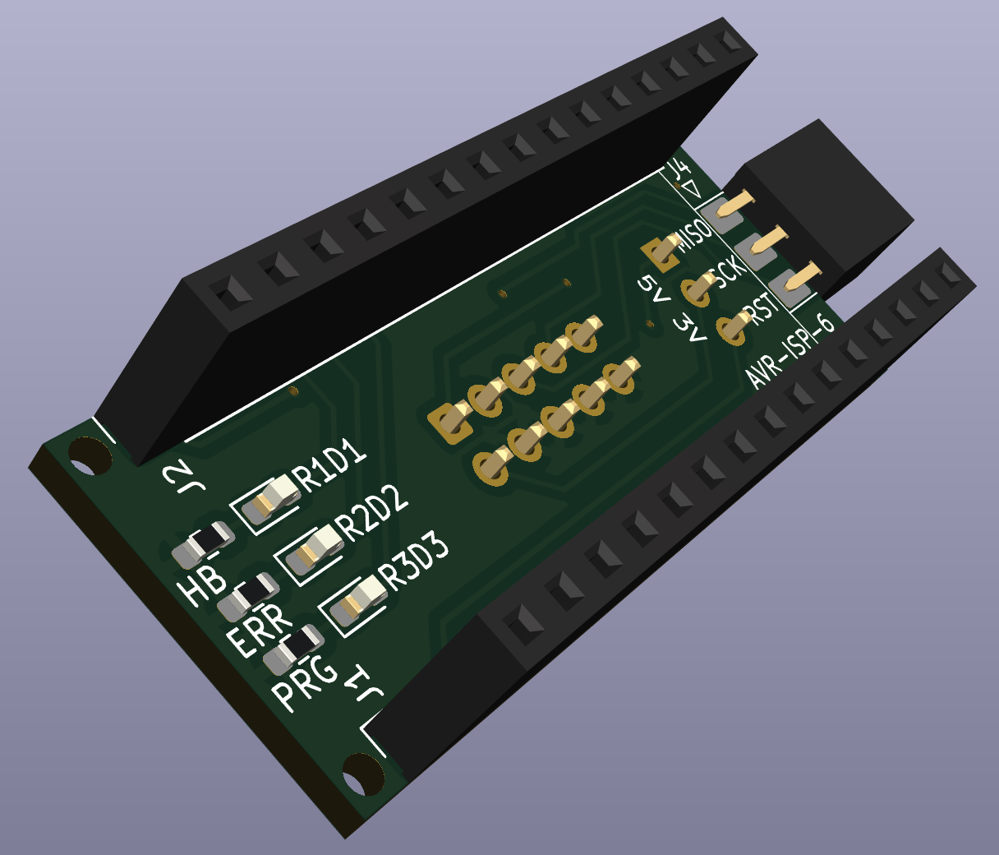

# ArduinoISP

A PCB to use an Arduino Nano as an In-Circuit Serial Programmer (ISP) for programming AVR microcontrollers.

## Overview

This board makes it easier for an Arduino Nano to function as an ISP programmer, enabling you to burn bootloaders to other Arduinos and program AVR chips like the ATmega series, or ATtiny microcontrollers.
To do that, it connects the Arduino Nano correctly to the microcontroller's SPI pins (MOSI, MISO, SCK) and reset pin.
The board is designed in a way that the 6-pin socket header can be directly soldered to the board vertically, while the 10-pin header can accept a flat cable with an adapter on the other end, similiar to the many USBASP clones.

## Hardware

The PCB includes:

- **Two 15-pin headers** for connecting to an Arduino Nano:
  - **J1 (Analog)**: Pins for A0-A7, AREF, 3V3, and power
  - **J2 (Digital)**: Pins for D0-D13, GND, and power
- **AVR-ISP-10 connector (J3)**: Standard 10-pin ICSP programming header for target devices
- **AVR-ISP-6 connector (J4)**: Standard 6-pin ICSP programming header for target devices
- **3 Status LEDs**: Heartbeat, Error and Program
- **Pull-up resistors (R2, R3)**: 220Ω current limiting for LEDs

### Assembly
- Start with the SMD resistors
- Next solder the LEDs
- Then the 2 6-Pin connectors
- Next solder the 10-Pin connector
- Do the 2 Arduino headers last

### Pin Mapping

The ISP programming uses the following connections from the Nano to the 6-pin ICSP connector:

| ISP Pin | Signal | Nano Pin |
|---------|--------|----------|
| 1 | MISO | D12 |
| 2 | VCC | +5V |
| 3 | SCK | D13 |
| 4 | MOSI | D11 |
| 5 | RST | D10 |
| 6 | GND | GND |

The standard ICSP header pinout looks like this, with the key (if present) next to SCK
|   |   |
|---|---|
| MISO | VCC |
| ] SCK | MOSI |
| RST | GND |

## Usage

### 1. Program the Arduino Nano

1. Open the ArduinoISP sketch: `File > Examples > 11.ArduinoISP > ArduinoISP`
2. Select your Nano board and port
3. Upload the sketch to the Nano

You can also find the sketch on the [official Arduino GitHub page](https://github.com/arduino/arduino-examples/blob/main/examples/11.ArduinoISP/ArduinoISP/ArduinoISP.ino)

### 2. Wire the Boards

Connect the Nano to this PCB's headers. The board will provide the 6-pin ISP connector for connecting to your target device.

### 3. Burn the Bootloader

1. Select the target board type in `Tools > Board`
2. Select `Arduino as ISP` in `Tools > Programmer`
3. Use `Tools > Burn Bootloader`

## Requirements

- Arduino Nano
- Target AVR microcontroller board
- Arduino IDE

## Notes

- Be cautious when programming 3.3V devices (Due, Zero, etc.) - ensure the jumper is set correctly.
